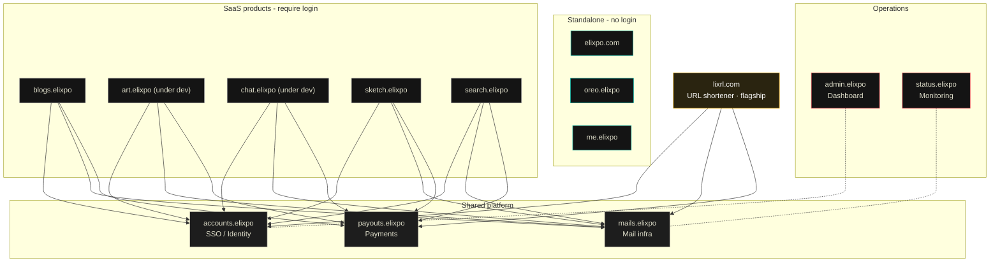

<div align="center">


<h1 align="center">lixrl</h1>

<p align="center">
  <strong>The flagship Elixpo URL shortener, running on the edge.</strong><br/>
  Lightning-fast redirects, click analytics, and a developer-first API.
  Free and open source, built by a global community of 45+ contributors.
</p>

<p align="center">
  <a href="https://lixrl.com">lixrl.com</a> ·
  <a href="https://lixrl.com/docs">API Docs</a> ·
  <a href="https://elixpo.com">Elixpo</a> ·
  <a href="https://github.com/orgs/elixpo/discussions">Discussions</a> ·
  <a href="https://github.com/elixpo/elixpo_chapter">Monorepo</a> ·
  <a href="https://github.com/sponsors/Circuit-Overtime">Sponsor</a>
</p>

<p align="center">
  <a href="https://lixrl.com"></a>
  
  
  
  
  
</p>

<div align="center">

</div>

## About

**lixrl** is the URL shortener built for the [Elixpo](https://elixpo.com)
ecosystem. It turns long URLs into clean, shareable short links — instantly.
Every redirect runs on Cloudflare's global edge network, so your links resolve
in milliseconds no matter where your audience is.

> This repository is the source for **lixrl** (package `elixpourl`) - the
> flagship Elixpo URL shortener at [lixrl.com](https://lixrl.com).

> Huge thanks to [Karan](https://github.com/karanray06) from our
> [GDG JIS University](https://gdg.community.dev/gdg-on-campus-jis-university-kolkata-india/)
> community for preparing the foundational HLD with us, on which lixrl was built
> with modifications made based on scale.

### Why lixrl?

- **Instant redirects** — Short links resolve at the edge, not from a central server. No cold starts, no latency spikes.
- **Click analytics** — See who's clicking, from where, on what device, and when. Understand your traffic at a glance.
- **Custom short codes** — Choose your own slugs like `lixrl.com/launch` instead of random strings.
- **Expiring links** — Set links to auto-expire after a date. Great for limited-time campaigns.
- **Developer-first API** — Create, read, update, and delete links programmatically with simple API keys.
- **SSO with Elixpo Accounts** — One login across the entire Elixpo ecosystem. No separate credentials to manage.

### Plans

| | Free | Pro | Business | Enterprise |
|---|---|---|---|---|
| **Short URLs** | 25 | 1,000 | 10,000 | Unlimited |
| **API keys** | 1 | 5 | 20 | 100 |
| **Analytics query window** | 7 days | 30 days | 365 days | 730 days |
| **Custom codes** | — | Yes | Yes | Yes |
| **Expiring links** | — | Yes | Yes | Yes |
| **Price** | Free forever | $5/mo | $19/mo | Custom |

### Get started

Head to **[lixrl.com](https://lixrl.com)** and sign in with your Elixpo account.
You can start shortening URLs immediately on the free plan — no credit card
required.

### API documentation

Full documentation is available at **[lixrl.com/docs](https://lixrl.com/docs)**.

### Running this project locally

```bash
npm install
npm run dev
```

Then open [http://localhost:3000](http://localhost:3000).

## The ecosystem

| Tool | What it does | Link |
| --- | --- | --- |
| 🎨 **Elixpo Art** | AI image generation _(under dev)_ | [art.elixpo.com](https://elixpo.com) |
| ✍️ **Elixpo Blogs** | A rich, modern writing and publishing space | [blogs.elixpo.com](https://blogs.elixpo.com) |
| 🖊️ **LixSketch** | A hand-drawn style whiteboard for ideas and diagrams | [sketch.elixpo.com](https://sketch.elixpo.com) |
| 💬 **Elixpo Chat** | A fluid, real-time AI chat experience _(under dev)_ | [chat.elixpo.com](https://chat.elixpo.com) |
| 🔎 **Elixpo Search** | Fast, AI-assisted search | [search.elixpo.com](https://search.elixpo.com) |
| 👤 **Elixpo Accounts** | One identity (SSO) across the ecosystem | [accounts.elixpo.com](https://accounts.elixpo.com) |
| 🔗 **lixrl** | Our flagship URL shortener | [lixrl.com](https://lixrl.com) |
| 🪪 **Portfolios** | Personal pages to showcase your work | [me.elixpo.com](https://me.elixpo.com) |
| 🐼 **Oreo** | The mascot's home | [oreo.elixpo.com](https://oreo.elixpo.com) |

Developers can drop our editors into their own projects with the
**`@elixpo/lixsketch`** and **`@elixpo/lixeditor`** packages, on npm and as VS
Code extensions.

## Architecture

Everything runs on **Cloudflare**. Three shared platform services back the
ecosystem, and products are either **SSO-backed SaaS**, **standalone**, or our
**flagship**:

- **`accounts.elixpo`** - single sign-on / identity
- **`mails.elixpo`** - shared mailing infrastructure
- **`payouts.elixpo`** - shared payments / payouts

SaaS products (Blogs, Art, Chat, Sketch, Search) and the flagship **lixrl.com**
all authenticate through Accounts (SSO) and share the Mail and Payouts infra.
The public, login-free surfaces (**elixpo.com**, **oreo.elixpo**, **me.elixpo**)
are standalone. **admin.elixpo** is the operations dashboard and
**status.elixpo** is monitoring.



A rendered, interactive version lives at **[elixpo.com/architecture](https://elixpo.com/architecture)**.

## Built by the community

Elixpo is made by people, in the open. **45+ contributors** have shaped these
tools, with a small core team steering the way:

- **Ayushman Bhattacharya** - Founder & Lead ([@Circuit-Overtime](https://github.com/Circuit-Overtime))
- **Vivek Yadav** - Lead Co-Dev ([@ez-vivek](https://github.com/ez-vivek))
- **Anwesha Chakraborty** - Core Maintainer ([@anwe-ch](https://github.com/anwe-ch))

Everyone is welcome. See **[CONTRIBUTING.md](CONTRIBUTING.md)** and our
**[Code of Conduct](CODE_OF_CONDUCT.md)**.

## Recognition & programs

Elixpo has taken part in and been supported by **GSSOC**, **Hacktoberfest**,
**Pollinations.AI**, **MS Startup Foundations**, and **OSCI**.

## Get involved

- 💬 **Join the conversation** in [GitHub Discussions](https://github.com/orgs/elixpo/discussions).
- 🚀 **Submit your project** to be featured across the ecosystem.
- 🛠️ **Contribute** - browse good first issues in the [monorepo](https://github.com/elixpo/elixpo_chapter).
- ❤️ **Support us** via [GitHub Sponsors](https://github.com/sponsors/Circuit-Overtime).

## Brand assets

Brand-ready marks and icons for lixrl live under [`public/`](public/), and the
brand source of truth (mascot, palette, rules) for the ecosystem is at
[`elixpo/brand/MASCOT.md`](https://github.com/elixpo/elixpo). A browsable kit is
at **[elixpo.com/assets](https://elixpo.com/assets)**.

## License

Elixpo uses one **licensing standard** across every repository:

- **Code** - [MIT](LICENSES/preferred/MIT) (with the [Oreo-trademarks exception](LICENSES/exceptions/Oreo-trademarks)).
- **Brand & visual assets** - [CC-BY-4.0](LICENSES/preferred/CC-BY-4.0) (with the same exception).

The Oreo mascot, the chest E-badge, and the "Elixpo" and "Oreo" names, domains,
and palette are reserved - this protects the brand and its royalties while
keeping the code and assets free. See [`LICENSE`](LICENSE) and the per-product
notice board, [`NOTICE`](LICENSES/NOTICE).

## Exclusive

> Per-repo "exclusive" artifacts (an npm package, a VS Code extension, a hosted
> SaaS, a paid tier) are declared here and in [`NOTICE`](LICENSES/NOTICE).

**This repository:** lixrl is an official Elixpo product on its own domain,
**lixrl.com** (off the `*.elixpo.com` tree). The **lixrl.com** domain, the
**"lixrl"** name and wordmark, and the official hosted deployment are reserved
to Elixpo - in addition to the `*.elixpo.com` identifiers in the
[Oreo-trademarks exception](LICENSES/exceptions/Oreo-trademarks) - and are
declared in [`NOTICE`](LICENSES/NOTICE). The source is MIT and may be reused;
forks must run under a different name and domain. No npm package, VS Code
extension, or separately-licensed binary is published; the public API at
lixrl.com is served from this source but is not a separately-distributed
artifact.

## Star history

<p align="center">
<a href="https://www.star-history.com/?repos=elixpo%2Felixpourl&type=date&legend=top-left">
 <picture>
   <source media="(prefers-color-scheme: dark)" srcset="https://api.star-history.com/image?repos=elixpo/elixpourl&type=date&theme=dark&legend=top-left" />
   <source media="(prefers-color-scheme: light)" srcset="https://api.star-history.com/image?repos=elixpo/elixpourl&type=date&legend=top-left" />
   
 </picture>
</a>
</p>

---

<p align="center">
  <sub>Made in the open, together. © 2023-2026 Elixpo.</sub>
</p>
