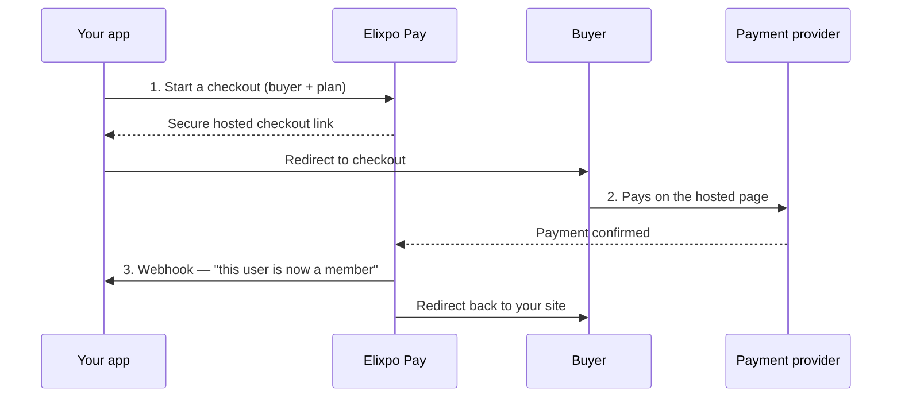

<div align="center">


# Elixpo Pay

**The payments and membership layer for the Elixpo ecosystem — and for any app that wants to charge for access.**

[Visit payouts.elixpo.com →](https://payouts.elixpo.com) · [Read the docs →](https://payouts.elixpo.com/docs)

</div>

---

## What is Elixpo Pay?

Elixpo Pay lets an app **charge people and unlock membership** without building a payments system from scratch.

Think of it as the money side of Elixpo Accounts (which handles sign-in). Your app sends a buyer to a secure, hosted checkout page; Elixpo Pay collects the payment, remembers what the person bought, and tells your app to switch them on. When the membership runs out, it tells your app to switch them back off.

You never touch card numbers, and you never have to track who paid for what — Elixpo Pay does both.

> **Live today:** first-party billing for [blogs.elixpo.com](https://blogs.elixpo.com), powered by Razorpay (INR). It's built as a multi-tenant SaaS, so other apps can plug in the same way.

---

## Why use it?

- 🔒 **No card data, ever.** Payments happen on a hosted page secured by the payment provider. Your app only ever sees "this person is now a member."
- 🧾 **Memberships, handled.** Elixpo Pay tracks each buyer's plan and expiry, and downgrades them automatically when it lapses.
- 🌍 **Fair regional pricing.** Show India one price and the rest of the world another — the price a buyer actually pays always comes from your own price list, so it can't be tampered with.
- 🔔 **Your app stays in sync.** The moment something changes, we notify your app (and you can also ask us at any time).
- 🎨 **A checkout that looks the part.** A polished, branded payment page with your product name, plan, and total — not a bare form.
- 🧩 **One key, one webhook.** Each app gets its own secret key and signing secret. No shared passwords to pass around.

---

## How it works



1. **Start checkout.** Your app asks Elixpo Pay to open a checkout for a buyer and a plan. We hand back a secure link.
2. **Buyer pays.** They complete payment on the hosted page. No card details ever reach your app.
3. **Access is granted.** Elixpo Pay records the membership and pings your app so it can unlock the right features — instantly.

---

## The dashboard

Sign in with **Elixpo Accounts** and you get a merchant dashboard to:

- Create a **product** and review its **pricing tiers** (defined in code — see below).
- Grab your **secret key** and **webhook signing secret**.
- Point your **webhook** at your app and choose which events you want (membership changes, payment notifications).
- Watch **revenue, active members, and transactions** at a glance.
- **Archive** a product to pause payments, and **unarchive** to resume.

---

## For developers

Everything is one hosted checkout plus a small REST API. The full guide lives at **[payouts.elixpo.com/docs](https://payouts.elixpo.com/docs)**:

- **Quickstart** — create a session, receive the webhook, read entitlements.
- **Catalog sync** — manage products & prices from a JSON file with `POST /v1/sync`.
- **Checkout sessions** — `POST /v1/checkout/sessions` with your secret key.
- **Webhooks** — verify signed `entitlement.updated` / `payment.captured` events.
- **Entitlements API** — read a buyer's current plan any time.

```js
// Start a checkout from your server:
const res = await fetch("https://payouts.elixpo.com/v1/checkout/sessions", {
  method: "POST",
  headers: {
    Authorization: "Bearer " + process.env.ELIXPO_PAY_API_KEY,
    "Content-Type": "application/json",
  },
  body: JSON.stringify({
    tier: "member",
    currency: "INR",
    customer: { uid: user.id, email: user.email },
    success_url: "https://yourapp.com/settings",
  }),
});

const { url } = await res.json();
redirect(url); // send the buyer to hosted checkout
```

---

## Built on

Next.js (App Router) · Cloudflare Pages, D1 & KV (edge runtime) · MUI · Razorpay. Sign-in via Elixpo Accounts (OAuth).

---

<div align="center">

Made with 🐼 by **[Elixpo](https://github.com/elixpo)**

</div>
