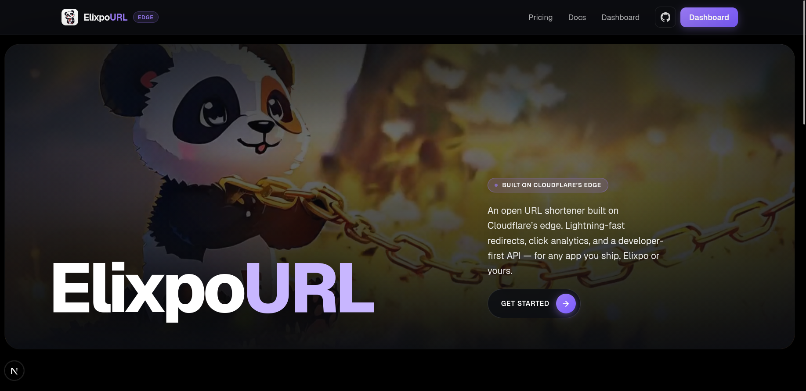
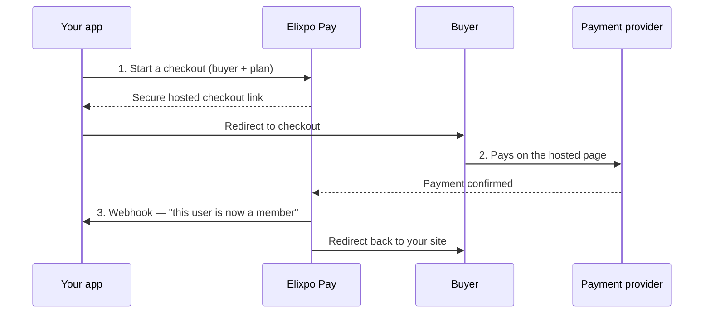

<!--
  ELIXPO README - follows the Elixpo standard template (see STANDARDS.md §4).
  Section order is shared across the ecosystem; the About and product sections
  are repo-specific.
-->

<p align="center">
  
</p>

<h1 align="center">Elixpo Pay</h1>

<p align="center">
  <strong>The payments and membership layer for the Elixpo ecosystem - and for any app that wants to charge for access.</strong><br/>
  Free and open source, built by a global community of 45+ contributors.
</p>

<p align="center">
  <a href="https://payouts.elixpo.com">payouts.elixpo.com</a> ·
  <a href="https://payouts.elixpo.com/docs">Docs</a> ·
  <a href="https://elixpo.com">Elixpo</a> ·
  <a href="https://github.com/orgs/elixpo/discussions">Discussions</a> ·
  <a href="https://github.com/elixpo/elixpo_chapter">Monorepo</a> ·
  <a href="https://github.com/sponsors/Circuit-Overtime">Sponsor</a>
</p>

---

## About

> This repository is the source for **Elixpo Pay** ([payouts.elixpo.com](https://payouts.elixpo.com)) -
> the multi-tenant payments & payouts SaaS for the Elixpo ecosystem. It is a
> shared platform service: a hosted, branded checkout, a unified ledger,
> entitlement grants with signed webhooks, per-app API credentials, code-managed
> pricing catalogs, and creator payouts - built edge-native on Cloudflare Pages,
> D1 & KV, with Razorpay (INR) and Elixpo Accounts SSO.

Elixpo Pay lets an app **charge people and unlock membership** without building a payments system from scratch.

Think of it as the money side of Elixpo Accounts (which handles sign-in). Your app sends a buyer to a secure, hosted checkout page; Elixpo Pay collects the payment, remembers what the person bought, and tells your app to switch them on. When the membership runs out, it tells your app to switch them back off.

You never touch card numbers, and you never have to track who paid for what - Elixpo Pay does both.

> **Live today:** first-party billing for [blogs.elixpo.com](https://blogs.elixpo.com), powered by Razorpay (INR). It's built as a multi-tenant SaaS, so other apps can plug in the same way.

### Why use it?

- 🔒 **No card data, ever.** Payments happen on a hosted page secured by the payment provider. Your app only ever sees "this person is now a member."
- 🧾 **Memberships, handled.** Elixpo Pay tracks each buyer's plan and expiry, and downgrades them automatically when it lapses.
- 🌍 **Fair regional pricing.** Show India one price and the rest of the world another - the price a buyer actually pays always comes from your own price list, so it can't be tampered with.
- 🔔 **Your app stays in sync.** The moment something changes, we notify your app (and you can also ask us at any time).
- 🎨 **A checkout that looks the part.** A polished, branded payment page with your product name, plan, and total - not a bare form.
- 🧩 **One key, one webhook.** Each app gets its own secret key and signing secret. No shared passwords to pass around.

### How it works



1. **Start checkout.** Your app asks Elixpo Pay to open a checkout for a buyer and a plan. We hand back a secure link.
2. **Buyer pays.** They complete payment on the hosted page. No card details ever reach your app.
3. **Access is granted.** Elixpo Pay records the membership and pings your app so it can unlock the right features - instantly.

### The dashboard

Sign in with **Elixpo Accounts** and you get a merchant dashboard to:

- Create a **product** and review its **pricing tiers** (defined in code - see below).
- Grab your **secret key** and **webhook signing secret**.
- Point your **webhook** at your app and choose which events you want (membership changes, payment notifications).
- Watch **revenue, active members, and transactions** at a glance.
- **Archive** a product to pause payments, and **unarchive** to resume.

### For developers

Everything is one hosted checkout plus a small REST API. The full guide lives at **[payouts.elixpo.com/docs](https://payouts.elixpo.com/docs)**:

- **Quickstart** - create a session, receive the webhook, read entitlements.
- **Catalog sync** - manage products & prices from a JSON file with `POST /v1/sync`.
- **Checkout sessions** - `POST /v1/checkout/sessions` with your secret key.
- **Webhooks** - verify signed `entitlement.updated` / `payment.captured` events.
- **Entitlements API** - read a buyer's current plan any time.

```js
// Start a checkout from your server:
const res = await fetch("https://payouts.elixpo.com/v1/checkout/sessions", {
  method: "POST",
  headers: {
    Authorization: "Bearer " + process.env.ELIXPO_PAY_API_KEY,
    "Content-Type": "application/json",
  },
  body: JSON.stringify({
    tier: "member",
    currency: "INR",
    customer: { uid: user.id, email: user.email },
    success_url: "https://yourapp.com/settings",
  }),
});

const { url } = await res.json();
redirect(url); // send the buyer to hosted checkout
```

### Built on

Next.js (App Router) · Cloudflare Pages, D1 & KV (edge runtime) · MUI · Razorpay. Sign-in via Elixpo Accounts (OAuth).

## The ecosystem

| Tool | What it does | Link |
| --- | --- | --- |
| 🎨 **Elixpo Art** | AI image generation _(under dev)_ | [art.elixpo.com](https://elixpo.com) |
| ✍️ **Elixpo Blogs** | A rich, modern writing and publishing space | [blogs.elixpo.com](https://blogs.elixpo.com) |
| 🖊️ **LixSketch** | A hand-drawn style whiteboard for ideas and diagrams | [sketch.elixpo.com](https://sketch.elixpo.com) |
| 💬 **Elixpo Chat** | A fluid, real-time AI chat experience _(under dev)_ | [chat.elixpo.com](https://chat.elixpo.com) |
| 🔎 **Elixpo Search** | Fast, AI-assisted search | [search.elixpo.com](https://search.elixpo.com) |
| 👤 **Elixpo Accounts** | One identity (SSO) across the ecosystem | [accounts.elixpo.com](https://accounts.elixpo.com) |
| 🔗 **lixrl** | Our flagship URL shortener | [lixrl.com](https://lixrl.com) |
| 🪪 **Portfolios** | Personal pages to showcase your work | [me.elixpo.com](https://me.elixpo.com) |
| 🐼 **Oreo** | The mascot's home | [oreo.elixpo.com](https://oreo.elixpo.com) |

Developers can drop our editors into their own projects with the
**`@elixpo/lixsketch`** and **`@elixpo/lixeditor`** packages, on npm and as VS
Code extensions.

## Built by the community

Elixpo is made by people, in the open. **45+ contributors** have shaped these
tools, with a small core team steering the way:

- **Ayushman Bhattacharya** - Founder & Lead ([@Circuit-Overtime](https://github.com/Circuit-Overtime))
- **Vivek Yadav** - Lead Co-Dev ([@ez-vivek](https://github.com/ez-vivek))
- **Anwesha Chakraborty** - Core Maintainer ([@anwe-ch](https://github.com/anwe-ch))

Everyone is welcome. See **[CONTRIBUTING.md](CONTRIBUTING.md)** and our
**[Code of Conduct](CODE_OF_CONDUCT.md)**.

## Recognition & programs

Elixpo has taken part in and been supported by **GSSOC**, **Hacktoberfest**,
**Pollinations.AI**, **MS Startup Foundations**, and **OSCI**.

## Get involved

- 💬 **Join the conversation** in [GitHub Discussions](https://github.com/orgs/elixpo/discussions).
- 🚀 **Submit your project** to be featured across the ecosystem.
- 🛠️ **Contribute** - browse good first issues in the [monorepo](https://github.com/elixpo/elixpo_chapter).
- ❤️ **Support us** via [GitHub Sponsors](https://github.com/sponsors/Circuit-Overtime).

## Brand assets

Brand marks and icons for this product live under [`public/`](public/), and the
brand source of truth (mascot, palette, rules) is documented on the main site.
A browsable kit is at **[elixpo.com/assets](https://elixpo.com/assets)**.

## License

Elixpo uses one **licensing standard** across every repository:

- **Code** - [MIT](LICENSES/preferred/MIT) (with the [Oreo-trademarks exception](LICENSES/exceptions/Oreo-trademarks)).
- **Brand & visual assets** - [CC-BY-4.0](LICENSES/preferred/CC-BY-4.0) (with the same exception).

The Oreo mascot, the chest E-badge, and the "Elixpo" and "Oreo" names, domains,
and palette are reserved - this protects the brand and its royalties while
keeping the code and assets free. See [`LICENSE`](LICENSE) and the per-product
notice board, [`NOTICE`](LICENSES/NOTICE).

## Exclusive

> Per-repo "exclusive" artifacts (an npm package, a VS Code extension, a hosted
> SaaS, a paid tier) are declared here and in [`NOTICE`](LICENSES/NOTICE).

**This repository:** Elixpo Pay is an official **hosted SaaS** at
[payouts.elixpo.com](https://payouts.elixpo.com). The brand, the hosted
deployment, the operational and merchant data, and the per-app API credentials
and signing secrets are reserved, and any **paid tier, plan, entitlement grant,
or commercial billing** operated under the Elixpo Pay brand is reserved. The
source is MIT - forks must operate under a different name.

---

## Running locally

```bash
npm install
npm run dev
```

Then open [http://localhost:3000](http://localhost:3000).

Useful scripts:

```bash
npm run lint            # Biome check
npm run format          # Biome check --write
npm run pages:build     # Build for Cloudflare Pages (@cloudflare/next-on-pages)
npm run db:migrate      # Apply D1 migrations (remote)
npm run db:migrate:local # Apply D1 migrations (local)
```

Deployment is driven by [`deploy.sh`](deploy.sh) onto Cloudflare Pages.

<div align="center">

Made with 🐼 by **[Elixpo](https://github.com/elixpo)**

</div>
