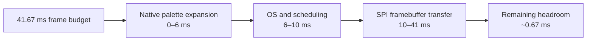
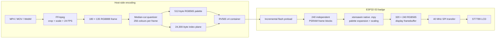
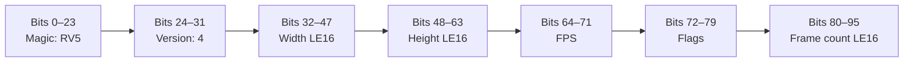
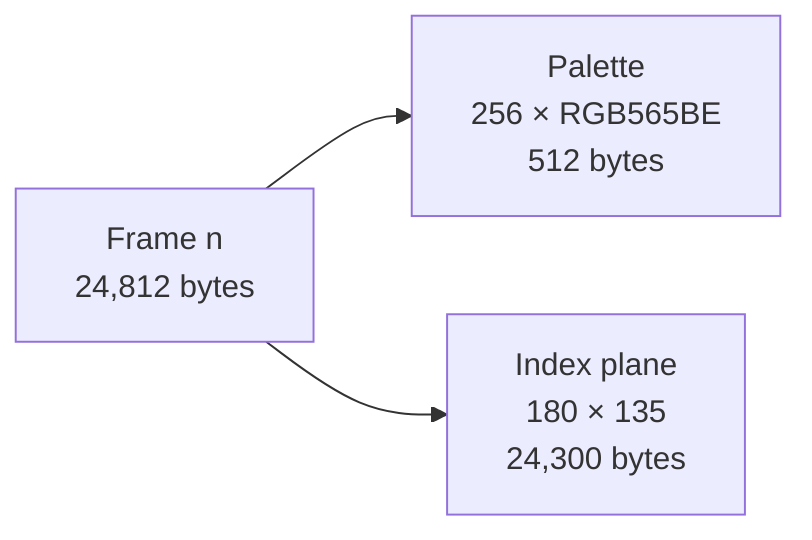
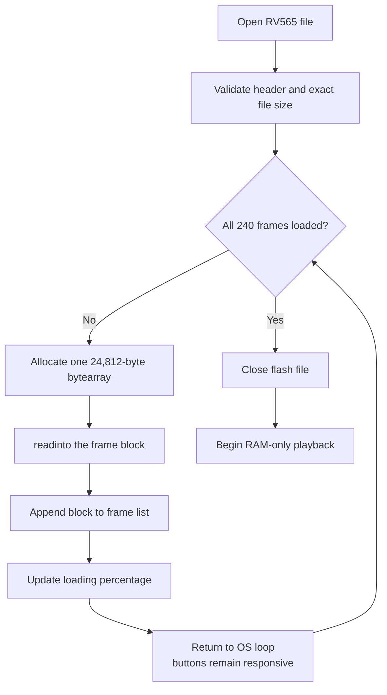
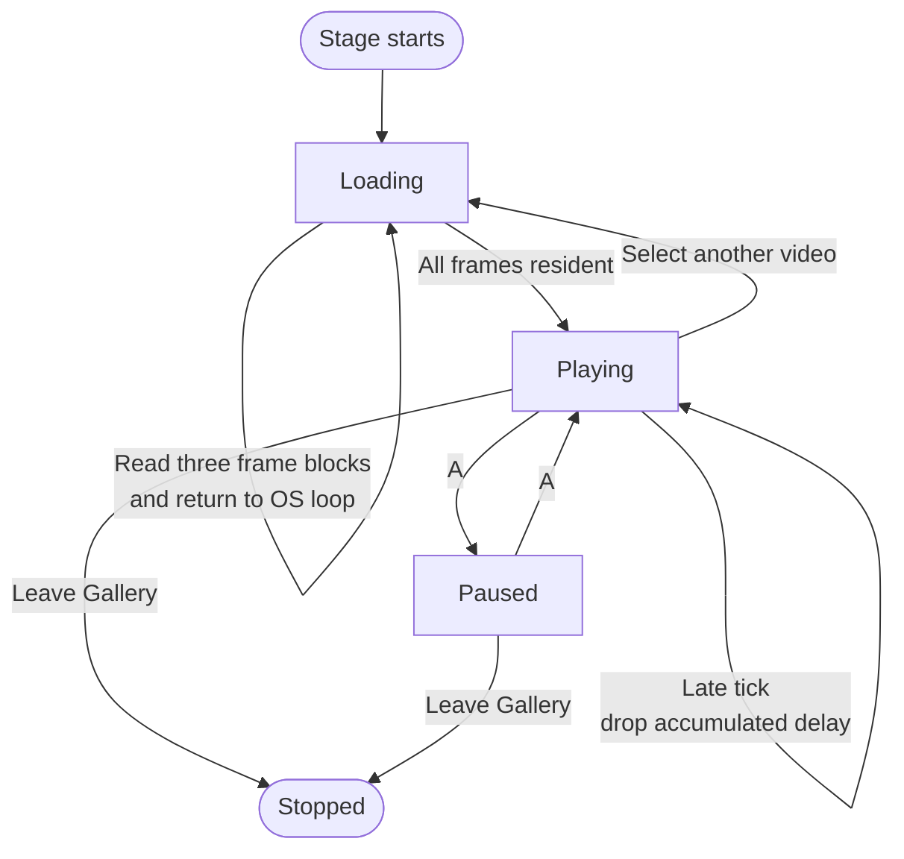

# From 0.5 FPS to Native Video: Building OreoOS Gallery Playback

OreoOS runs on an ESP32-S3 badge with a 320 × 240 RGB565 display, MicroPython,
and a deliberately small application model. Adding video to Gallery initially
looked like an image-decoding problem. In practice, it became a systems problem
spanning storage bandwidth, Python interpreter overhead, PSRAM fragmentation,
display timing, input latency, and deployment.

This is the architecture we arrived at: an offline encoder produces an indexed
`RV565 v4` stream; Gallery preloads it into small PSRAM frame blocks; a dynamic
native C module expands each frame directly into the display buffer; and the
normal OreoOS event loop remains responsible for timing and buttons.

The result is a measured native render-and-display ceiling of approximately
25.6 FPS, with content scheduled at 24 FPS.

## The hardware budget

The display is an ST7789-compatible 320 × 240 panel connected over 40 MHz SPI.
One full RGB565 frame is:

```text
320 × 240 × 2 bytes = 153,600 bytes
```

Sending that frame takes about 30.7 ms on the wire before software overhead.
A 24 FPS video has a 41.67 ms frame period, leaving roughly 11 ms for every
other operation: locating a frame, decoding it, scaling it, updating UI state,
and servicing input.



That constraint rules out any architecture that performs per-pixel work in
Python or reads a large frame from flash on every tick.

## Why the first versions were slow

Gallery evolved through several `RV565` variants. Each version taught us where
the actual bottleneck lived.

| Approach | Measured cost | Consequence |
|---|---:|---|
| Python nearest-neighbour scaling, 160 × 120 → 320 × 240 | ~367 ms/frame | About 2–3 FPS before LCD transfer |
| Persistent Deflate stream producing RGB565 | ~234 ms/frame | Native inflate helped, but was still far outside budget |
| Raw indexed frame read from flash + native scale | ~40 ms before LCD | Flash bandwidth became the bottleneck |
| Indexed frame from PSRAM + native scale | ~5.2 ms | Leaves enough time for the 31 ms LCD transfer |
| Native scale + real LCD transfer | ~39.0 ms | ~25.6 FPS measured ceiling |

The key lesson is that “native decode” is not enough by itself. The full data
path must fit the deadline. Moving pixel expansion to C removed interpreter
overhead, but reading roughly 25–30 KB from the filesystem every frame still
consumed most of the budget. Preloading removed that repeated I/O cost.

## The final pipeline



The host does the expensive colour analysis. The badge does only deterministic
work: select the current frame block, map its indices through a palette, scale
to the viewport, and transfer the framebuffer.

## RV565 v4 on disk

V4 keeps the original 12-byte `RV565` header so Gallery can dispatch old and
new files through the same reader.



The header is followed by fixed-size frames:



At 24 FPS for ten seconds:

```text
frame_size = 512 + (180 × 135) = 24,812 bytes
payload    = 24,812 × 240       = 5,954,880 bytes
file_size  = payload + 12       = 5,954,892 bytes
```

Each frame owns an adaptive 256-colour palette. This costs 512 bytes per frame,
but it gives materially better colour reproduction than a fixed RGB332 palette
and avoids the blocky, low-colour look of the earlier experiments. Dithering is
disabled to prevent a static scene from shimmering as palettes change.

The host encoder lives in `tools/encode_gallery_video.py`. FFmpeg performs
cover-scaling and cropping, while Pillow performs median-cut quantization and
converts the palette to big-endian RGB565 bytes, which match the panel transfer
order used by OreoOS.

## Why PSRAM uses frame blocks instead of one giant buffer

The first preload implementation allocated one 5.95 MB `bytearray`. It worked
on a freshly reset badge, but could fail after the launcher, Gallery photos,
network services, and temporary UI objects had fragmented the heap. Total free
memory was not the problem; the allocator needed one contiguous 5.95 MB region.

The final loader allocates one frame at a time:



Gallery loads three complete frame blocks per update. That keeps filesystem
reads bounded and lets the launcher poll buttons and repaint the progress bar
between chunks. It also makes allocation tolerant of heap fragmentation: the
allocator needs a contiguous region of only ~24 KB, not ~6 MB.

The frame list is released when the user changes media or leaves Gallery, then
MicroPython garbage collection returns the blocks to PSRAM.

## A native module without rebuilding firmware

The badge firmware does not expose `micropython.viper`, so decorating a Python
function with `@micropython.viper` was not an option. It does, however, report
MicroPython `.mpy` ABI version 6, native sub-version 3, and the `xtensawin`
architecture.

That allows Gallery to ship a dynamically loadable native module compiled for
the ESP32-S3 windowed Xtensa ABI:

```text
apps/gallery/src/gallery_native.mpy
```

The source is in `apps/gallery/native/gallery_native.c`. Its playback function
accepts a frame block, an offset, the destination framebuffer, and both source
and destination dimensions. It then:

1. builds 320-entry X and 240-entry Y nearest-neighbour lookup tables;
2. reads one 8-bit palette index for every output pixel;
3. copies the matching 16-bit RGB565 value directly into `Display._buf`;
4. returns without allocating a full-size intermediate frame.

```mermaid
sequenceDiagram
    participant Loop as OreoOS loop
    participant Gallery
    participant Native as gallery_native.mpy
    participant FB as Display._buf
    participant LCD as ST7789

    Loop->>Gallery: update(dt)
    Gallery->>Gallery: select frame block
    Loop->>Gallery: draw(display)
    Gallery->>Native: indexed_scale_at(frame, 0, framebuffer, ...)
    Native->>FB: write 76,800 RGB565 pixels
    Native-->>Gallery: return (~5.2 ms)
    Loop->>LCD: display.present()
    LCD-->>Loop: full frame sent (~31 ms)
```

The same module exposes `rgb565_scale()` for photos. Large Gallery images can
therefore scale into the framebuffer in native code instead of spending
hundreds of milliseconds in nested Python loops.

## Playback timing and controls

Video playback remains inside the standard OreoOS application lifecycle. No
second event loop or background thread owns the screen.



The launcher polls hardware buttons before calling `app.update()`. Native frame
expansion and LCD output take about 39 ms together, so LEFT, RIGHT, A, B, and
HOME are observed at approximately video-frame latency. If one tick runs late,
Gallery advances at most one frame and discards excess accumulated delay. It
never tries to “catch up” by decoding a burst, which would freeze controls.

## Deployment and compatibility

The deploy manifest includes both `.py` and `.mpy` files under an app's `src/`
tree. Gallery videos under `assets/optimized/` are also included explicitly.

For a Gallery-only replacement:

```bash
python3 tools/deploy.py --override=gallery
```

`--override=gallery` removes the device-side Gallery tree first, preventing an
interrupted large video transfer from leaving duplicate or partial assets. It
does not imply `--force`; unchanged files outside Gallery remain hash-skipped.

Gallery still reads RV565 versions 1–3 for compatibility. V4 requires the
matching `xtensawin` native module. The reader validates magic, version,
dimensions, FPS, frame count, and exact payload size before allocating or
playing anything. Runtime failures are logged and shown on-screen instead of
being collapsed into an unexplained “broken video” state.

## What this architecture optimizes for

This is not a general-purpose H.264 decoder. It is a format designed around one
specific embedded display pipeline:

- fixed 320 × 240 output;
- short Gallery clips;
- predictable 24 FPS timing;
- high visual quality for the available flash and PSRAM;
- low input latency;
- no custom firmware rebuild;
- compatibility with OreoOS's existing app and deployment model.

The largest gain did not come from a single compression trick. It came from
assigning each stage to the resource that handles it best: colour quantization
on the host, bulk storage in PSRAM, pixel loops in native Xtensa code, and UI
control in the normal MicroPython event loop.
